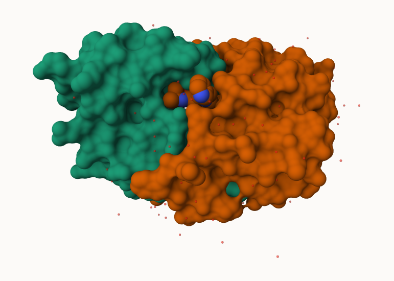
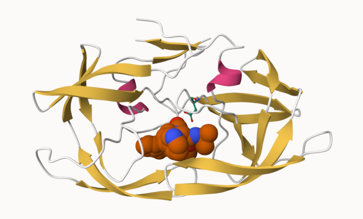
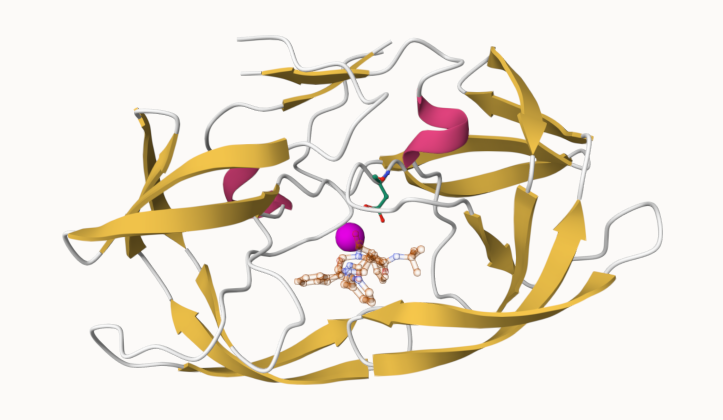

## The PDB database

The [Protein Data Bank (PDB)](https://www.rcsb.org/) is the main repository of biomolecular structure data . Let's see what is in it:

```{r}
stats <- read.csv("pdb_stats.csv", row.names = 1)
stats
```


> Q1: What percentage of structures in the PDB are solved by X-Ray and Electron
Microscopy.

```{r}
n.sums <- colSums(stats)
n <- n.sums/n.sums["Total"]
round(n, digits=2)
```
81% for X-Ray and 13% for Electron Microscopy

> What is the total number of entries in the PDB?

```{r}
n.sums["Total"]
```


> Q2: What proportion of structures in the PDB are protein?

```{r}
(214078+15759+13981)/249018 
```


> Q3: Type HIV in the PDB website search box on the home page and determine how many HIV-1 protease structures are in the current PDB?

1,173 

## Using Molstar

We can use the main [Molstar viewer online](https://molstar.org/viewer/):




> Q. Generate and insert an image of the HIV-Pr cartoon colored by secondary structure, showing the inhibitor (ligand) in spacefill. 



> Q. One fimal image showing catalytic APS 25 and the all-important active site water molecule.



## The bio3D package for structural bioinformatics

```{r}
library(bio3d)

hiv <- read.pdb("1hsg")
hiv
```

```{r}
head( hiv$atom )
```

```{r}
pdbseq(hiv)
```

Let's try out the new bio3dview package that is not yet on CRAN. We can use the **remotes** package to install any R package from GitHub.

### Quick viewing of PDBs

```{r}
library(bio3dview)

sele <- atom.select(hiv, resno=25)
#view.pdb(hiv, backgroundColor = "pink",
         #highlight = sele,
       # highlight.style = "spacefill")
```

### Prediction of Protein flexiblity

```{r}
adk <- read.pdb("6s36")
m <- nma(adk)
plot(m)
```

Write out our results as a wee trajectory movie:

```{r}
#mktrj(m, file="results.pdb")
```


```{r}
#view.nma(m)
```

## Comparative protein structure analysis with PCA

We start with a database id

```{r}
library(bio3d)

id <- "1ake_A"
aa <- get.seq(id)
```

```{r}
blast <- blast.pdb(aa)
```

Have a wee peak
```{r}
head(blast$hit.tbl)
```

```{r}
hits <- plot(blast)
```

peak at our "top hits"
```{r}
head(hits$pdb.id)
```

Now we can download these "top hits" these will all be ADK structures in the PDB database. 

```{r}
files <- get.pdb(hits$pdb.id, path="pdbs", split=TRUE, gzip=TRUE)
```

We need one package from BioConductor. To set this up we need to first install a package called **BiocManager** from CRAN.

Now we can use the `install()` function from this package like this:
`BiocManager::install("msa")`

```{r}
pdbs <- pdbaln(files, fit=TRUE, exefile="msa")
```

Let's have a wee peak at our structures after "fitting" or superposing:

```{r}
library(bio3dview)

#view.pdbs(pdbs)
```

```{r}
#view.pdbs(pdbs, colorScheme="residue")
```

We can run functions like `rmsd()`, `rmsf()` and the best `pca()`
```{r}
pc.xray <- pca(pdbs)
plot(pc.xray)
```

```{r}
plot(pc.xray, 1:2)
```

Finally, Let's make a wee movie of the major "motion" or structural difference in the dataset - we call this "trajectory"

```{r}
mktrj(pc.xray, file="results.pdb")
```


