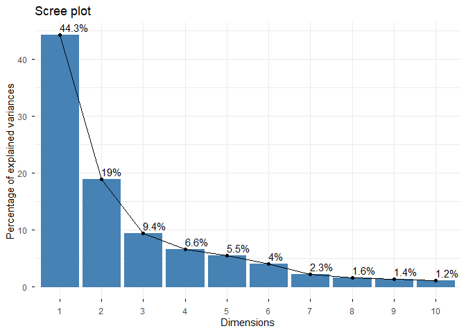
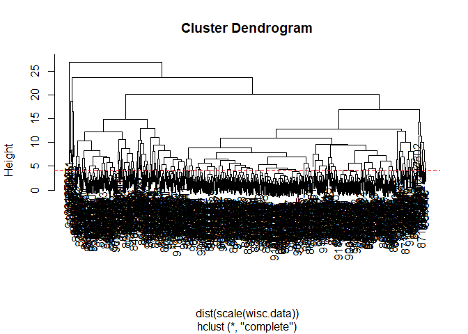

# Class 8 Breast Cancer Mini Project
Patrick Nguyen (ID:A17680785)

- [Background](#background)
- [Data Import](#data-import)
- [Principal Component Analysis
  (PCA)](#principal-component-analysis-pca)
  - [Scree plot](#scree-plot)
- [4. Hierarchical clustering](#4-hierarchical-clustering)
  - [Combining methods](#combining-methods)
  - [Prediction](#prediction)

## Background

In today’s class we will be employing all the R techniques for data
analysis that we have learned thus far - including the machine learning
methods of clustering and PCA - to analyze real breast cancer biopsy
data.

## Data Import

The data is in CSV format:

``` r
#read.csv("WisconsinCancer.csv")
```

``` r
wisc.df <- read.csv("WisconsinCancer.csv", row.names=1)
#wisc.df
```

wee peak at the data

``` r
head(wisc.df, 3)
```

             diagnosis radius_mean texture_mean perimeter_mean area_mean
    842302           M       17.99        10.38          122.8      1001
    842517           M       20.57        17.77          132.9      1326
    84300903         M       19.69        21.25          130.0      1203
             smoothness_mean compactness_mean concavity_mean concave.points_mean
    842302           0.11840          0.27760         0.3001             0.14710
    842517           0.08474          0.07864         0.0869             0.07017
    84300903         0.10960          0.15990         0.1974             0.12790
             symmetry_mean fractal_dimension_mean radius_se texture_se perimeter_se
    842302          0.2419                0.07871    1.0950     0.9053        8.589
    842517          0.1812                0.05667    0.5435     0.7339        3.398
    84300903        0.2069                0.05999    0.7456     0.7869        4.585
             area_se smoothness_se compactness_se concavity_se concave.points_se
    842302    153.40      0.006399        0.04904      0.05373           0.01587
    842517     74.08      0.005225        0.01308      0.01860           0.01340
    84300903   94.03      0.006150        0.04006      0.03832           0.02058
             symmetry_se fractal_dimension_se radius_worst texture_worst
    842302       0.03003             0.006193        25.38         17.33
    842517       0.01389             0.003532        24.99         23.41
    84300903     0.02250             0.004571        23.57         25.53
             perimeter_worst area_worst smoothness_worst compactness_worst
    842302             184.6       2019           0.1622            0.6656
    842517             158.8       1956           0.1238            0.1866
    84300903           152.5       1709           0.1444            0.4245
             concavity_worst concave.points_worst symmetry_worst
    842302            0.7119               0.2654         0.4601
    842517            0.2416               0.1860         0.2750
    84300903          0.4504               0.2430         0.3613
             fractal_dimension_worst
    842302                   0.11890
    842517                   0.08902
    84300903                 0.08758

> Q1. How many observations are in this dataset?

``` r
nrow(wisc.df)
```

    [1] 569

> Q2. How many of the observations have a malignant diagnosis?

``` r
sum(wisc.df$diagnosis == "M")
```

    [1] 212

``` r
table(wisc.df$diagnosis)
```


      B   M 
    357 212 

> Q3. How many variables/features in the data are suffixed with \_mean?

``` r
length(grep("_mean", colnames(wisc.df)))
```

    [1] 10

We need to remove the `diagnosis` column before we do any further
analysis of this dataset - we don’t want to pass this to PCA etc. We
will save it as a seperate wee vector that we can use later to compare
our findings to those of experts.

``` r
wisc.data <- wisc.df[ ,-1]
diagnosis <- wisc.df$diagnosis
```

## Principal Component Analysis (PCA)

The main function in base R is called `prcomp()` we will use the
optional argument `scake=TRUE` here as the data
columns/features.dimensions are on very different scales in the original
data set.

``` r
wisc.pr <- prcomp(wisc.data, scale=T)
```

``` r
attributes(wisc.pr)
```

    $names
    [1] "sdev"     "rotation" "center"   "scale"    "x"       

    $class
    [1] "prcomp"

``` r
library(ggplot2)

ggplot(wisc.pr$x) +
  aes(PC1, PC2, col=diagnosis) +
  geom_point()
```


> Q4. From your results, what proportion of the original variance is
> captured by the first principal component (PC1)?

``` r
summary(wisc.pr)
```

    Importance of components:
                              PC1    PC2     PC3     PC4     PC5     PC6     PC7
    Standard deviation     3.6444 2.3857 1.67867 1.40735 1.28403 1.09880 0.82172
    Proportion of Variance 0.4427 0.1897 0.09393 0.06602 0.05496 0.04025 0.02251
    Cumulative Proportion  0.4427 0.6324 0.72636 0.79239 0.84734 0.88759 0.91010
                               PC8    PC9    PC10   PC11    PC12    PC13    PC14
    Standard deviation     0.69037 0.6457 0.59219 0.5421 0.51104 0.49128 0.39624
    Proportion of Variance 0.01589 0.0139 0.01169 0.0098 0.00871 0.00805 0.00523
    Cumulative Proportion  0.92598 0.9399 0.95157 0.9614 0.97007 0.97812 0.98335
                              PC15    PC16    PC17    PC18    PC19    PC20   PC21
    Standard deviation     0.30681 0.28260 0.24372 0.22939 0.22244 0.17652 0.1731
    Proportion of Variance 0.00314 0.00266 0.00198 0.00175 0.00165 0.00104 0.0010
    Cumulative Proportion  0.98649 0.98915 0.99113 0.99288 0.99453 0.99557 0.9966
                              PC22    PC23   PC24    PC25    PC26    PC27    PC28
    Standard deviation     0.16565 0.15602 0.1344 0.12442 0.09043 0.08307 0.03987
    Proportion of Variance 0.00091 0.00081 0.0006 0.00052 0.00027 0.00023 0.00005
    Cumulative Proportion  0.99749 0.99830 0.9989 0.99942 0.99969 0.99992 0.99997
                              PC29    PC30
    Standard deviation     0.02736 0.01153
    Proportion of Variance 0.00002 0.00000
    Cumulative Proportion  1.00000 1.00000

44.27% of variance was captured

> Q5. How many principal components (PCs) are required to describe at
> least 70% of the original variance in the data?

3 principal components (PCs 1 to 3) are needed to describe 70% of the
original variance

> Q6. How many principal components (PCs) are required to describe at
> least 90% of the original variance in the data?

7 principal components (PCs 1 to 7) are needed to describe 90% of the
original variance

> Q7. What stands out to you about this plot? Is it easy or difficult to
> understand? Why?

``` r
biplot(wisc.pr)
```


This plot is hard to read due to the large amount of labels on the graph
making it difficult to distern what each label means as well as seeing
the points on the graph

> Q8. Generate a similar plot for principal components 1 and 3. What do
> you notice about these plots?

``` r
library(ggplot2)

ggplot(wisc.pr$x) +
  aes(PC1, PC3, col=diagnosis) +
  geom_point()
```


this scatter plot has a similar spread to the PC1 vs PC2 plot but this
plot has the points located generally at a lower y-axis area than the
PC1 vs PC2 plot.

### Scree plot

``` r
library(factoextra)
```

    Welcome! Want to learn more? See two factoextra-related books at https://goo.gl/ve3WBa

``` r
fviz_eig(wisc.pr, addlabels = TRUE)
```

    Warning in geom_bar(stat = "identity", fill = barfill, color = barcolor, :
    Ignoring empty aesthetic: `width`.



> Q9. For the first principal component, what is the component of the
> loading vector (i.e. wisc.pr\$rotation\[,1\]) for the feature
> concave.points_mean? This tells us how much this original feature
> contributes to the first PC. Are there any features with larger
> contributions than this one?

``` r
pc1_loading_concave <- wisc.pr$rotation["concave.points_mean", "PC1"]

pc1_loading_concave
```

    [1] -0.2608538

``` r
pc1_loadings <- wisc.pr$rotation[, "PC1"]


ordered_loadings <- sort(abs(pc1_loadings), decreasing = TRUE)


head(ordered_loadings, 10)
```

     concave.points_mean       concavity_mean concave.points_worst 
               0.2608538            0.2584005            0.2508860 
        compactness_mean      perimeter_worst      concavity_worst 
               0.2392854            0.2366397            0.2287675 
            radius_worst       perimeter_mean           area_worst 
               0.2279966            0.2275373            0.2248705 
               area_mean 
               0.2209950 

``` r
abs(pc1_loading_concave)
```

    [1] 0.2608538

``` r
ordered_loadings["concave.points_mean"]
```

    concave.points_mean 
              0.2608538 

concave.points_mean is the largest contributor, ever other contributor
is smaller than concave.points_mean

# 4. Hierarchical clustering

The goal of this section is to do hierarchical clustering of the
original data to see if there is any obvious grouping into malignant and
benign clusters

In short, these results are not good!

First we will scale our `wisc.data` then calculate a distance matrix

``` r
wisc.hclust <- hclust( dist( scale(wisc.data)))
wisc.hclust.clusters <- cutree(wisc.hclust, k=2)
table(wisc.hclust.clusters)
```

    wisc.hclust.clusters
      1   2 
    567   2 

## Combining methods

The idea here is that I can take my new variables (i.e. the scores on
the PCs `wisc.pr$x`) that are better descriptors of the data-set than
the original features (i.e. the 30 columns in `wisc.data`) and use these
as a basis for clustering.

``` r
pc.dist <- dist(wisc.pr$x[ ,1:3])
wisc.pr.hclust <- hclust(pc.dist, method = "ward.D2")
plot(wisc.pr.hclust)
```


``` r
grps <- cutree(wisc.pr.hclust, k=2)
table(grps)
```

    grps
      1   2 
    203 366 

I can now run `table()` with both my clustering `grps` and the expert
`diagnosis`

``` r
table(grps, diagnosis)
```

        diagnosis
    grps   B   M
       1  24 179
       2 333  33

Our cluster “1” has 179 “M” diagnosis or cluster “2” has 333 “B”
diagnosis

179 TP 24 FP 333 TN 33 FN

Sensitivity: TP/(TP+FN)

``` r
179/(179+33)
```

    [1] 0.8443396

Specificity: TN/(TN+FP)

``` r
333/(333+24)
```

    [1] 0.9327731

> Q10. Using the plot() and abline() functions, what is the height at
> which the clustering model has 4 clusters?

``` r
wisc.hclust <- hclust(dist(scale(wisc.data)))
plot(wisc.hclust)
abline(h = 4, col="red", lty=2)
```



at around a height of 15 is when the cluster model has 4 clusters.

> Q12. Which method gives your favorite results for the same data.dist
> dataset? Explain your reasoning.

I prefer ward.d2 because in my opinion it organizes the clusters the
best out of all the methods which makes interpreting the cluster model
not too difficult compared to other methods as the other methods make
the clusters look too cluttered.

> Q14. How well do the hierarchical clustering models you created in the
> previous sections (i.e. without first doing PCA) do in terms of
> separating the diagnoses? Again, use the table() function to compare
> the output of each model (wisc.hclust.clusters and
> wisc.pr.hclust.clusters) with the vector containing the actual
> diagnoses.

``` r
table(wisc.hclust.clusters, diagnosis)
```

                        diagnosis
    wisc.hclust.clusters   B   M
                       1 357 210
                       2   0   2

``` r
wisc.pr.hclust.clusters <- cutree(wisc.pr.hclust, k = 2)
table(wisc.pr.hclust.clusters, diagnosis)
```

                           diagnosis
    wisc.pr.hclust.clusters   B   M
                          1  24 179
                          2 333  33

The “PR” cluster seperates better than the other cluster model as the
ratios of Benign and Malignant for the “PR” cluster model are larger
then the other cluster model.

## Prediction

We can use our PCA model for prediction of new un-seen cases.

``` r
#url <- "new_samples.csv"
url <- "https://tinyurl.com/new-samples-CSV"
new <- read.csv(url)
npc <- predict(wisc.pr, newdata=new)
npc
```

               PC1       PC2        PC3        PC4       PC5        PC6        PC7
    [1,]  2.576616 -3.135913  1.3990492 -0.7631950  2.781648 -0.8150185 -0.3959098
    [2,] -4.754928 -3.009033 -0.1660946 -0.6052952 -1.140698 -1.2189945  0.8193031
                PC8       PC9       PC10      PC11      PC12      PC13     PC14
    [1,] -0.2307350 0.1029569 -0.9272861 0.3411457  0.375921 0.1610764 1.187882
    [2,] -0.3307423 0.5281896 -0.4855301 0.7173233 -1.185917 0.5893856 0.303029
              PC15       PC16        PC17        PC18        PC19       PC20
    [1,] 0.3216974 -0.1743616 -0.07875393 -0.11207028 -0.08802955 -0.2495216
    [2,] 0.1299153  0.1448061 -0.40509706  0.06565549  0.25591230 -0.4289500
               PC21       PC22       PC23       PC24        PC25         PC26
    [1,]  0.1228233 0.09358453 0.08347651  0.1223396  0.02124121  0.078884581
    [2,] -0.1224776 0.01732146 0.06316631 -0.2338618 -0.20755948 -0.009833238
                 PC27        PC28         PC29         PC30
    [1,]  0.220199544 -0.02946023 -0.015620933  0.005269029
    [2,] -0.001134152  0.09638361  0.002795349 -0.019015820

``` r
plot(wisc.pr$x[,1:2], col=grps)
points(npc[,1], npc[,2], col="blue", pch=16, cex=3)
text(npc[,1], npc[,2], c(1,2), col="white")
```


> Q16. Which of these new patients should we prioritize for follow up
> based on your results?

Based on the graph the 2nd group of patients (2 on graph) should be
prioritized due to the high amount of patients that have malignant
cancer.
