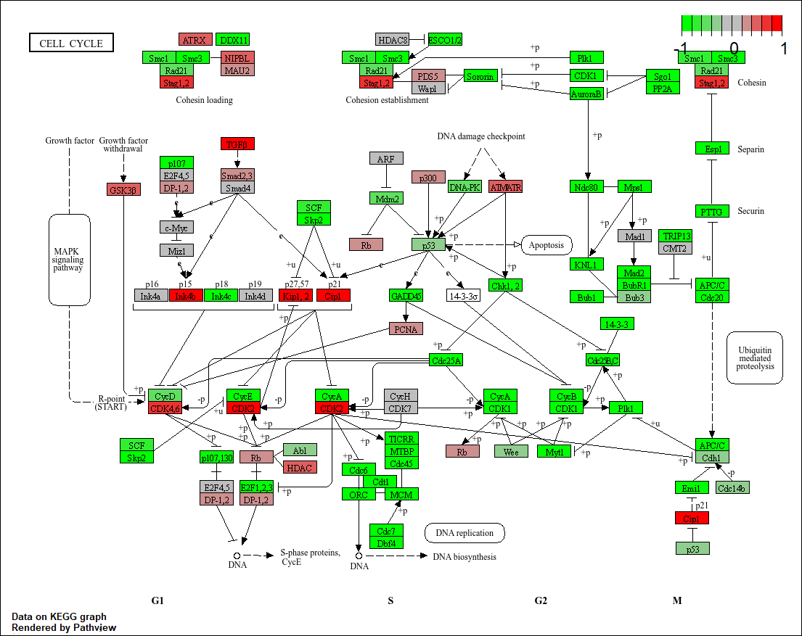
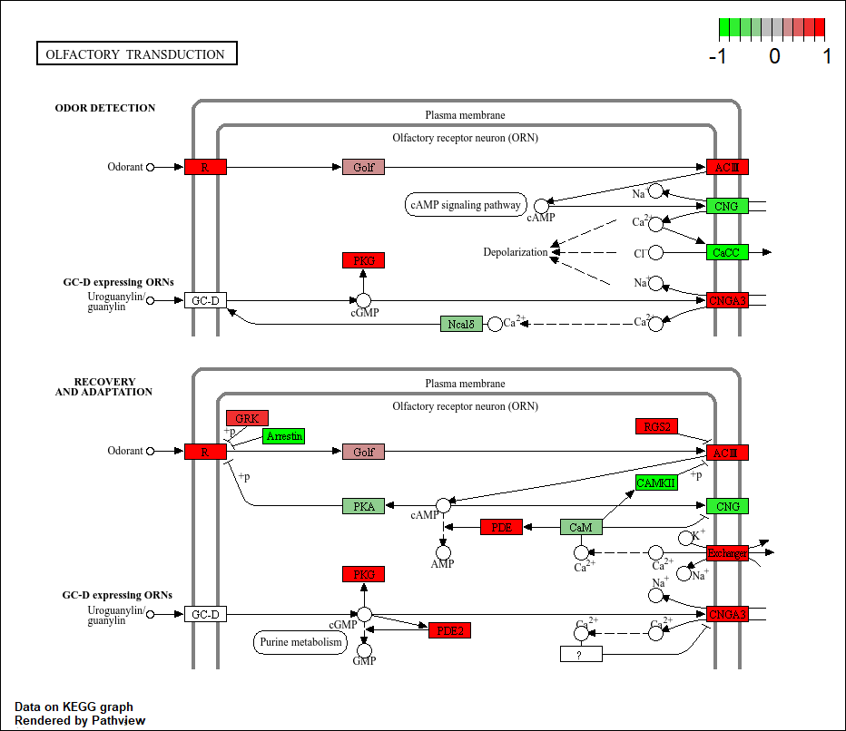
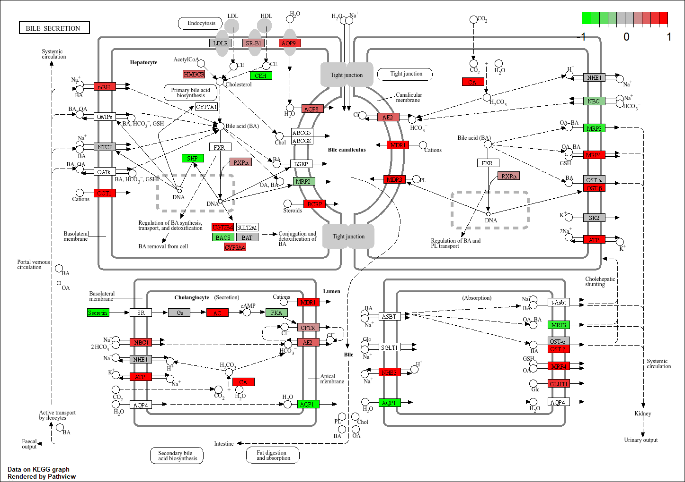

## Background

The data for today's mini-project comes from a knock-down study of an important HOX gene.

## Data Import

```{r}
countData <- read.csv("GSE37704_featurecounts.csv", row.names=1)
colData <- read.csv("GSE37704_metadata.csv", row.names=1)
```

```{r}
head(countData)
```

```{r}
head(colData)
```


### Clean up (data tidying)

We need to remove the length column from our `countData` to make the columns match the rows in `colData`.

```{r}
countData <- countData[,-1]
```

Check match of `colData` and `countData`
```{r}
rownames(colData) == colnames(countData)
```

```{r}
head(countData)
```

### Remove zero count genes
```{r}
to.keep <- rowSums(countData) > 0
countData <- countData[to.keep,]
```


## DESeq Analysis

```{r, message=FALSE}
library(DESeq2)
```

### Setting up the DESeq object

```{r}
dds <- DESeqDataSetFromMatrix(countData = countData, 
                              colData = colData, 
                              design = ~condition)
```


### Running DESeq

```{r}
dds <- DESeq(dds)
dds
```


### Getting results

```{r}
res = results(dds)
head(res)
```


## Volcano plot

A plot of log2 fold change vs -log of Adjusted P-value

```{r}
library(ggplot2)
```

```{r}
ggplot(res) +
  aes(log2FoldChange, -log(padj)) +
  geom_point()
```

```{r}
mycols <- rep("gray", nrow(res))
mycols[res$log2FoldChange > 2] <- "blue"
mycols[res$log2FoldChange < -2] <- "blue"
mycols[ res$padj >= 0.05 ] <- "gray"
```

```{r}
ggplot(res) +
  aes(x= log2FoldChange, y= -log(padj)) +
  geom_point(col = mycols) +
  xlab("Log2(FoldChange)") +
  ylab("-Log(P-value)") +
  geom_vline(xintercept = c(-2,+2), col="red") +
  geom_hline(yintercept = -log(0.05), col="red")
```

## Add Annotation

```{r}
library("AnnotationDbi")
library("org.Hs.eg.db")
```

```{r}
columns(org.Hs.eg.db)
```


```{r}
res$symbol = mapIds(org.Hs.eg.db,
                    keys=row.names(res), 
                    keytype="ENSEMBL",
                    column="SYMBOL",
                    multiVals="first")

res$entrez = mapIds(org.Hs.eg.db,
                    keys=row.names(res),
                    keytype="ENSEMBL",
                    column="ENTREZID",
                    multiVals="first")

res$name =   mapIds(org.Hs.eg.db,
                    keys=row.names(res),
                    keytype="ENSEMBL",
                    column="GENENAME",
                    multiVals="first")

head(res, 10)
```

```{r}
res = res[order(res$pvalue),]
write.csv(res, file="deseq_results.csv")
```

## Pathway Analysis

```{r}
library(pathview)
library(gage)
library(gageData)
```

```{r}
data(kegg.sets.hs)
data(sigmet.idx.hs)
```


### KEGG


```{r}
# Focus on signaling and metabolic pathways only
kegg.sets.hs = kegg.sets.hs[sigmet.idx.hs]

# Examine the first 3 pathways
head(kegg.sets.hs, 3)
```

```{r}
foldchanges = res$log2FoldChange
names(foldchanges) = res$entrez
head(foldchanges)
```

```{r}
keggres = gage(foldchanges, gsets=kegg.sets.hs)
```

```{r}
attributes(keggres)
```

```{r}
head(keggres$less)
```

```{r}
pathview(gene.data=foldchanges, pathway.id="hsa04110")
```



```{r}
pathview(gene.data=foldchanges, pathway.id="hsa04110", kegg.native=FALSE)
```


```{r}
## Focus on top 5 upregulated pathways here for demo purposes only
keggrespathways <- rownames(keggres$greater)[1:5]

# Extract the 8 character long IDs part of each string
keggresids = substr(keggrespathways, start=1, stop=8)
keggresids
```

```{r}
pathview(gene.data=foldchanges, pathway.id=keggresids, species="hsa")
```







### GO

```{r}
data(go.sets.hs)
data(go.subs.hs)

# Focus on Biological Process subset of GO
gobpsets = go.sets.hs[go.subs.hs$BP]

gobpres = gage(foldchanges, gsets=gobpsets)

lapply(gobpres, head)
```


### Reactome

```{r}
sig_genes <- res[res$padj <= 0.05 & !is.na(res$padj), "symbol"]
print(paste("Total number of significant genes:", length(sig_genes)))
```

```{r}
write.table(sig_genes, file="significant_genes.txt", row.names=FALSE, col.names=FALSE, quote=FALSE)
```

> Q: What pathway has the most significant “Entities p-value”? Do the most significant pathways listed match your previous KEGG results? What factors could cause differences between the two methods?

The pathway with the most significant p-value is "cell Cycle, Mitotic". The most significant pathways are similar to the KEGG results in that they both mention the "cell cycle" and "meiosis".  Reactome slightly differs in that it specifies the specific process step (ex:DNA replication). The differences from these methods is due to the level of depth that each database goes into regarding their results which can affect both the number of genes displayed in the path way and the retrieved p-values from the results. 


.
